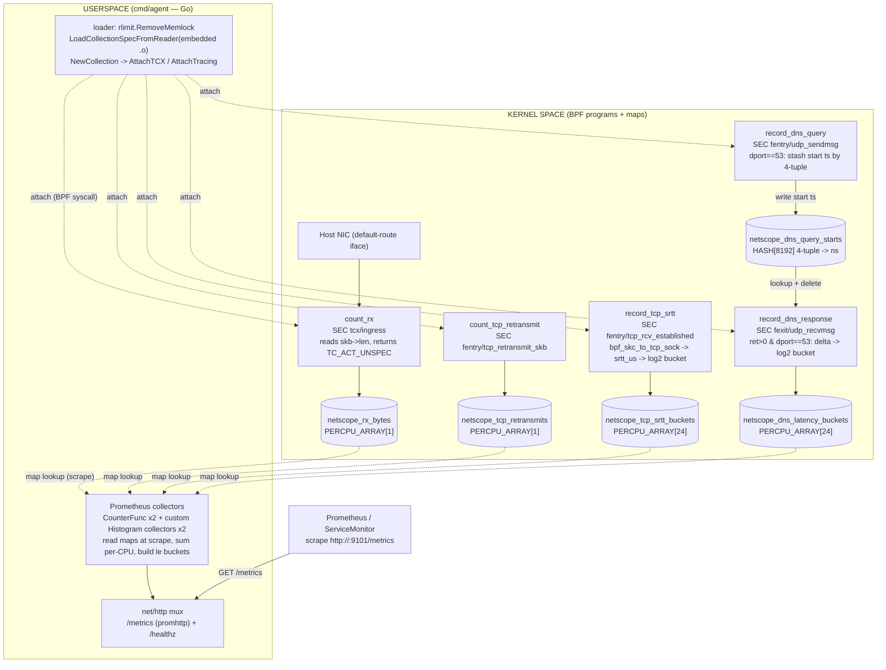

# netscope architecture

Long-form architecture reference for the netscope agent: what it observes, how
the kernel/BPF side and the Go userspace side split responsibilities, and how a
packet or socket event becomes a Prometheus sample on `:9101/metrics`.

This complements the top-level [`README.md`](../README.md) (quick start) and the
[`postmortems/`](./postmortems/) (why specific design choices were forced).

## Purpose & context

netscope is a per-node eBPF network exporter for the Talos homelab. It runs as a
DaemonSet, attaches BPF programs to a host NIC and to a handful of kernel TCP/UDP
functions, aggregates the signals into per-CPU BPF maps in the kernel, and
exposes them as Prometheus metrics.

It deliberately targets signals **not** already covered by Cilium/Hubble:

- **RX bytes** on the host's primary interface, observed at `tcx` ingress —
  including host-network, node-to-node management-plane, and off-cluster LAN
  traffic that never enters a Cilium-managed pod netns.
- **TCP retransmits**, host-wide, via `fentry` on `tcp_retransmit_skb`.
- **TCP smoothed RTT (SRTT)** as a histogram, via `fentry` on
  `tcp_rcv_established`.
- **DNS resolver-side query latency** as a histogram, via `fentry` on
  `udp_sendmsg` + `fexit` on `udp_recvmsg`.

It is observation-only. The `tcx` classifier returns `TC_ACT_UNSPEC` so it never
alters packet disposition, and the tracing programs only read fields and bump
map counters — they never touch socket or packet state.

## The userspace ↔ kernel split

netscope has two halves that meet at the BPF map / BPF syscall boundary:

- **Kernel side** — five BPF programs (compiled from a single C file) plus the
  maps they write. These run in kernel context on every relevant packet/socket
  event and do all the hot-path aggregation in-kernel (per-CPU counters and
  log2 histogram bucketing). They never talk to Prometheus and never leave the
  kernel; they only write map cells.
- **Userspace side** — the Go agent (`cmd/agent`). It loads the compiled BPF
  object, attaches each program to its hook, then registers Prometheus
  collectors that **read** the maps lazily at scrape time and convert raw
  per-CPU cells into counters and cumulative-`le` histograms. It owns the HTTP
  server and the metric-shaping logic; it does **no** per-packet work.

The boundary is the BPF map. The kernel side is a pure producer (write-only into
maps, on the hot path); the userspace side is a pure consumer (read-only from
maps, only on scrape). There is no perf-event ring buffer or streaming channel —
all cross-boundary transfer is via lazy map lookups driven by Prometheus
scrapes.



The dotted edges are the **userspace ↔ kernel boundary**: attach calls
(`bpf()` syscalls issued once at startup) and map lookups (`bpf()` syscalls
issued lazily on each `/metrics` scrape). Everything inside `kernel` runs on the
packet/socket hot path; everything inside `user` runs only at startup or scrape
time.

## End-to-end runtime flow

Startup (`cmd/agent/main.go`, `run()`):

1. **Resolve interface.** `NETSCOPE_IFACE` env var if set, else discover the
   IPv4 default-route interface by parsing `/proc/net/route`
   (`cmd/agent/iface.go`). No static fallback — a failed discovery exits with a
   clear error rather than attaching to the wrong NIC.
2. **Remove memlock rlimit** (`rlimit.RemoveMemlock`) — a no-op on kernels
   ≥ 5.11 (BPF memory is charged to memcg) but kept for older kernels.
3. **Load the embedded object.** `ebpf.LoadCollectionSpecFromReader` over the
   `go:embed`-ed `netscope.bpf.o` bytes, then `ebpf.NewCollection` — this is
   where the verifier runs and CO-RE relocations are applied against the target
   kernel's BTF.
4. **Look up programs and maps by name**, failing loudly if any is missing.
   Two **drift guards** assert the SRTT and DNS map `MaxEntries()` equal the
   Go-side bucket constants (`srttNumBuckets`/`dnsNumBuckets`, both 24) so the
   kernel `#define` and Go loop can never silently diverge.
5. **Attach each program to its hook:**
   - `count_rx` → `link.AttachTCX` at `tcx/ingress` on the resolved iface. It
     anchors *before* Cilium's `cil_from_netdev` program (discovered by name via
     `BPF_PROG_GET_NEXT_ID`) so netscope sees every packet, not just those
     Cilium leaves with `TC_ACT_UNSPEC`.
   - `count_tcp_retransmit`, `record_tcp_srtt`, `record_dns_query` →
     `link.AttachTracing` with `AttachTraceFEntry`.
   - `record_dns_response` → `link.AttachTracing` with `AttachTraceFExit`.
6. **Register Prometheus collectors** (see below) and start `net/http` on
   `:9101` with `/metrics` (promhttp) and `/healthz`.
7. Block on `SIGINT`/`SIGTERM`; on shutdown, close every link and the HTTP
   server (deferred `Close()` calls detach the programs).

Steady state — kernel side (per event, in-kernel):

- Each RX packet on the iface: `count_rx` adds `skb->len` to the single
  per-CPU cell of `netscope_rx_bytes`.
- Each TCP retransmit: `count_tcp_retransmit` increments a per-CPU cell of
  `netscope_tcp_retransmits`.
- Each received segment on an established TCP socket: `record_tcp_srtt` narrows
  the sock with `bpf_skc_to_tcp_sock`, reads `srtt_us`, computes a log2 bucket,
  and bumps that bucket in `netscope_tcp_srtt_buckets`.
- Each `udp_sendmsg` with `skc_dport == htons(53)`: `record_dns_query` stashes
  `bpf_ktime_get_ns()` under a `{saddr,daddr,sport,dport}` key in
  `netscope_dns_query_starts`.
- Each `udp_recvmsg` return `> 0` with `skc_dport == htons(53)`:
  `record_dns_response` looks up the matching start ts, deletes it, computes
  `delta_us`, and bumps a log2 bucket in `netscope_dns_latency_buckets`.

Steady state — userspace side (per scrape, lazy):

- `netscope_rx_bytes_total{iface=...}` and `netscope_tcp_retransmits_total` are
  `prometheus.CounterFunc`s: on scrape they call `readPerCPUSum`, which looks up
  key 0 and sums across `ebpf.MustPossibleCPU()` CPUs.
- `netscope_tcp_srtt_microseconds` and `netscope_dns_query_microseconds` are
  custom `prometheus.Collector`s (`srttHistogramCollector`,
  `dnsLatencyHistogramCollector`). On scrape they read all 24 per-CPU cells,
  sum across CPUs, and emit **cumulative** `le` buckets (converted to seconds)
  via `MustNewConstHistogram`. SRTT converts the kernel's scaled `srtt_us`
  (actual µs × 8): `le = 2^(i+1) / 8 / 1e6` s; DNS buckets raw µs:
  `le = 2^(i+1) / 1e6` s. `_sum` is reported as 0 (not tracked yet).

### Actual listen address & metrics path

- **Listen address:** `:9101` (constant `metricsListenAddr` in
  `cmd/agent/main.go`; also `EXPOSE 9101` in the Dockerfile and `hostPort: 9101`
  in the DaemonSet).
- **Metrics path:** `/metrics` (served by `promhttp.Handler()`).
- **Health path:** `/healthz` (returns 200 unconditionally today; probes hit it
  on `127.0.0.1:9101`).

## Metrics exported

| Metric | Type | Source hook | Map |
|---|---|---|---|
| `netscope_rx_bytes_total{iface}` | counter | `tcx/ingress` (`count_rx`) | `netscope_rx_bytes` |
| `netscope_tcp_retransmits_total` | counter | `fentry/tcp_retransmit_skb` | `netscope_tcp_retransmits` |
| `netscope_tcp_srtt_microseconds` | histogram | `fentry/tcp_rcv_established` | `netscope_tcp_srtt_buckets` |
| `netscope_dns_query_microseconds` | histogram | `fentry/udp_sendmsg` + `fexit/udp_recvmsg` | `netscope_dns_latency_buckets` |

Retransmits carry no per-iface label (retransmits are per-socket and the egress
NIC can differ from the rx side); the ServiceMonitor instead promotes a
`nodename` label, which is the dimension that matters for "is one node
retransmitting more than its peers".

## External integrations & dependencies

**eBPF toolchain / library.** The Go side uses [`cilium/ebpf`](https://github.com/cilium/ebpf)
`v0.18.0` (`ebpf`, `ebpf/link`, `ebpf/rlimit`) for loading, attaching, and map
I/O. Metrics use `prometheus/client_golang` `v1.20.5`. Those are the only two
direct dependencies in `go.mod` (Go 1.23); everything else is indirect.

**How the BPF object is built and loaded.** netscope does **not** use `bpf2go`.
The single C source `internal/bpf/src/netscope.bpf.c` is compiled directly with
`clang -O2 -g -target bpf -D__TARGET_ARCH_x86` (see `make bpf` and the
Dockerfile builder stage) into `internal/bpf/netscope.bpf.o`. That `.o` is then
embedded into the Go binary with a plain `//go:embed netscope.bpf.o` in
`internal/bpf/embed.go` (`var Object []byte`). At runtime the agent parses those
bytes with `ebpf.LoadCollectionSpecFromReader` and instantiates them with
`ebpf.NewCollection`. Consequence: a local `go build` outside Docker fails until
`make bpf` has produced the `.o`.

**CO-RE, no vmlinux.h.** Rather than checking a multi-MB `vmlinux.h` into the
repo, the C source declares *shadow* structs (`sock_common`, `sock`,
`tcp_sock`) containing only the fields it touches, each marked
`__attribute__((preserve_access_index))`. libbpf rewrites the field offsets at
load time against the target kernel's BTF. This is why `/sys/kernel/btf` is
mounted into the container.

**Kernel requirements.**

- **BTF** must be present (`CONFIG_DEBUG_INFO_BTF=y`) for CO-RE relocations and
  `fentry`/`fexit` attach — the agent mounts `/sys/kernel/btf` read-only.
- **`tcx`** attach requires kernel ≥ 6.6; the traced symbols
  (`tcp_retransmit_skb`, `tcp_rcv_established`, `udp_sendmsg`, `udp_recvmsg`)
  are long-standing `EXPORT_SYMBOL_GPL` exports — hence the BPF `LICENSE`
  string is `"GPL"` and the C file is `SPDX GPL-2.0` (a single-file exception
  in the otherwise Apache-2.0 repo). Production runs Talos 6.18.x.
- **Kernel lockdown gotcha.** Talos boots every node with
  `lockdown=confidentiality`, which NULLs the `probe_read`-family helper protos
  for tracing programs. Any `bpf_probe_read{,_user,_kernel}` from an
  `fentry`/`fexit` program is rejected with "cannot use helper
  `bpf_probe_read#4`". This is why the programs use **direct BTF-typed field
  access** only (never `BPF_CORE_READ`, which lowers to a probe-read helper),
  and why the planned per-domain DNS payload parse was abandoned — see
  [`postmortems/2026-06-16-dns-probe-read-helper4.md`](./postmortems/2026-06-16-dns-probe-read-helper4.md).

**Privilege / capabilities.** The container runs as `runAsUser: 0`,
`privileged: false`, `seccompProfile: RuntimeDefault`, `hostNetwork: true`,
with a narrow cap set:

- `CAP_BPF` — load programs and create maps.
- `CAP_PERFMON` — attach tracing programs.
- `CAP_NET_ADMIN` — `tcx` attach.
- `CAP_SYS_ADMIN` — required for `bpf(BPF_PROG_GET_NEXT_ID)`, used at startup to
  enumerate loaded programs and find Cilium's ingress program by name for
  anchor placement.

It also mounts `/sys/fs/bpf` (HostToContainer) and `/sys/kernel/btf` (read-only)
from the host.

## Key design decisions

- **Why eBPF.** These signals (SRTT distribution, retransmits, resolver latency,
  host-network bytes) live in the kernel TCP/UDP stack and on interfaces outside
  Cilium's pod-netns view. eBPF reads them at the source with near-zero overhead
  and no packet capture.
- **Per-CPU maps + scrape-time aggregation.** Counters and histograms use
  `BPF_MAP_TYPE_PERCPU_ARRAY` so the hot path is a lock-free `__sync_fetch_and_add`
  on a CPU-local cell. Userspace sums across `MustPossibleCPU()` (not
  `runtime.NumCPU()`, which can undercount on cgroup-restricted/hot-plug hosts)
  only at scrape time. No perf ring buffer, no streaming — the kernel does the
  aggregation, userspace does the shaping.
- **Log2 histograms, bucketed in-kernel.** SRTT and DNS latency are bucketed to
  powers of two in the BPF program (an unrolled shift-and-compare loop, avoiding
  `__builtin_clz` which segfaults the bookworm LLVM-14 BPF backend). SRTT
  deliberately buckets on the kernel's *scaled* `srtt_us` (×8) because scaling
  by a power of two only renames buckets; userspace accounts for the `>>3` when
  labelling `le`.
- **`bpf_skc_to_tcp_sock` for the SRTT read.** A plain `(struct tcp_sock *)sk`
  cast fails the verifier ("access beyond struct sock"); the BTF-typed helper
  returns a verifier-blessed `tcp_sock *`. See
  [`postmortems/2026-05-10-srtt-verifier-iterations.md`](./postmortems/2026-05-10-srtt-verifier-iterations.md).
- **DNS latency by in-kernel 4-tuple correlation.** `record_dns_query` stashes a
  start timestamp keyed by `{saddr,daddr,sport,dport=53}`; `record_dns_response`
  matches on the same tuple. `fexit` (not `fentry`) on `udp_recvmsg` so the
  return value distinguishes a real datagram copy from `-EAGAIN` wakeups. Known
  coverage gap: only *connected* UDP sockets populate `skc_dport`
  (systemd-resolved, Go's `net.Resolver`); classic glibc `res_send`/`sendto`
  callers are missed.
- **Anchor before Cilium.** netscope attaches its `tcx` program ahead of
  `cil_from_netdev` by resolving Cilium's live program ID at startup (IDs are not
  stable across cilium restarts). Safe because `count_rx` only reads `skb->len`
  and returns `TC_ACT_UNSPEC`.
- **`cmd/cismoke` kernel-load smoke.** Compile-only CI cannot see verifier
  rejections. `cmd/cismoke` loads the `.o` and attempts every attach against a
  real kernel in a vmtest VM booted with `lockdown=confidentiality` (to
  reproduce the Talos gate). It fails loudly if a `SEC()` exists with no attach
  coverage.

## Deployment

**Image.** Built by GitHub Actions (`.github/workflows/build.yml`) natively on
amd64 and pushed to **`ghcr.io/gjcourt/netscope`** (multi-stage Dockerfile:
`golang:1.23-bookworm` builder compiles the BPF `.o` + static Go binary, then
`gcr.io/distroless/static-debian12` runtime). CI tags with the branch slug and
the 7-char SHA. Local arm64 Docker builds hit QEMU/Go segfaults — CI is the
build path.

**In-cluster.** netscope deploys as a DaemonSet via Flux/Kustomize under the
homelab GitOps repo at `homelab/apps/base/netscope/` (base) with a staging
overlay at `homelab/apps/staging/netscope/`. The base DaemonSet:

- Runs on **all 6 nodes** (3 CP + 3 workers) — `tolerations: [{operator: Exists}]`,
  no nodeSelector — because CP nodes route a non-trivial share of Cilium VXLAN /
  control-plane traffic.
- `hostNetwork: true`, `hostPID: false`, `dnsPolicy: ClusterFirstWithHostNet`.
- **Not** `privileged`; `runAsUser: 0`, `allowPrivilegeEscalation: false`,
  `seccompProfile: RuntimeDefault`, caps `BPF`/`PERFMON`/`NET_ADMIN`/`SYS_ADMIN`,
  drop `ALL`.
- Pins a digest-locked image tag (e.g. `ghcr.io/gjcourt/netscope:<tag>@sha256:...`).
- Exposes metrics on `hostPort: 9101`; a `ServiceMonitor`
  (`homelab/apps/base/netscope/servicemonitor.yaml`) scrapes `/metrics` every
  30s, promotes `__meta_kubernetes_pod_node_name` to a `nodename` label, and
  drops the churny `pod` label under hostNetwork.
- Namespace convention: `netscope` (production) / `netscope-stage` (staging);
  the namespace enforces `pod-security: privileged` to permit hostNetwork + caps.

The in-repo `deploy/` manifests and the `deploy/helm/netscope` chart are the
standalone equivalents (the chart parameterizes iface, caps, metrics port,
probes, and node selection); the homelab repo is the source of truth for what
actually runs.

## Repo layout

```text
cmd/agent/          Go entrypoint: iface discovery, load/attach, collectors, HTTP
cmd/cismoke/        Kernel-load smoke: load .o + attempt each attach in a vmtest VM
internal/bpf/       go:embed of the compiled .o (embed.go) + the .o itself
internal/bpf/src/   netscope.bpf.c — the BPF C source (5 programs, 5 maps)
deploy/             Standalone Kubernetes manifests + Helm chart
docs/               This doc + postmortems/
.github/workflows/  CI: lint/vet/test, kernel-smoke (vmtest), image build+push
Dockerfile          Multi-stage clang+Go builder -> distroless static runtime
```
